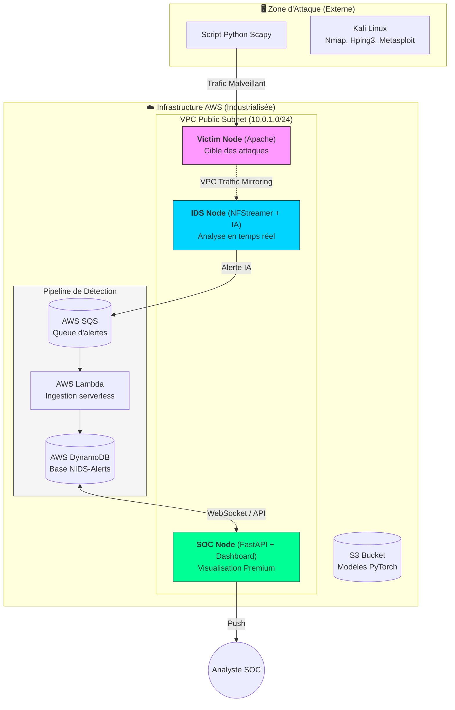

# 🛡️ PFE-NIDS-AI: Deep Learning-based Network Intrusion Detection System

[](https://opensource.org/licenses/Apache-2.0)
[](https://www.python.org/downloads/)
[](https://aws.amazon.com/)

## 📝 Project Overview

This project is a **Network Intrusion Detection System (NIDS)** developed as part of a Final Year Project (PFE). It leverages advanced **Deep Learning** techniques to identify and classify cyber-attacks in real-time by analyzing network traffic patterns.

Unlike traditional signature-based IDS, this system uses behavioral analysis to detect both known threats and sophisticated zero-day attacks.

### 🎯 Objectives
1.  **Detection**: Identify anomalous behaviors and attacks within a network.
2.  **Classification**: Categorize intrusions (DDoS, Port Scanning, Unauthorized Access, etc.).
3.  **Real-world Evaluation**: Use the **CICIDS 2017** dataset for robust training and testing.
4.  **Benchmarking**: Compare multiple deep learning architectures to find the most efficient model.
5.  **Cloud Deployment**: Implementation of a **Cyberrange on AWS** for real-world testing.

---

## 📂 Dataset: CICIDS 2017

The models were trained and evaluated using the **CICIDS 2017** dataset.
- **Description**: It provides a comprehensive set of network traffic data, including benign behaviors and common simulated attacks (DDoS, Brute Force, XSS, SQL Injection, etc.).
*   **Environment**: Captured in a realistic network environment over a period of 5 days.
*   **Significance**: It is one of the most widely used datasets for benchmarking modern AI-based NIDS due to its diversity and volume.

---

## 📊 Model Performance Comparison

The project involved training and evaluating **11 different architectures**. Below is a summary of the performance metrics achieved on the test dataset:

| Model Architecture | Accuracy (%) | Precision (%) | Recall (%) | F1-Score (%) | AUC-ROC | Training Time (s) |
| :--- | :---: | :---: | :---: | :---: | :---: | :---: |
| **Attention MLP** | **98.28** | **98.46** | **98.28** | **98.29** | **0.9995** | 258.8 |
| **CNN-LSTM** | 98.14 | 98.52 | 98.14 | 97.99 | 0.9995 | 3502.8 |
| **ResNet1D** | 98.14 | 98.32 | 98.14 | 98.12 | 0.9995 | 639.8 |
| **BiLSTM** | 97.92 | 98.08 | 97.92 | 97.94 | 0.9992 | 2227.4 |
| **CNN1D** | 97.84 | 98.32 | 97.84 | 97.71 | 0.9990 | 355.3 |
| **GRU** | 97.83 | 98.11 | 97.83 | 97.81 | 0.9992 | 631.8 |
| **AE Classifier** | 97.74 | 97.99 | 97.74 | 97.64 | 0.9990 | 330.3 |
| **LSTM** | 97.71 | 98.12 | 97.71 | 97.56 | 0.9992 | 934.5 |
| **TCN** | 97.62 | 97.87 | 97.62 | 97.59 | 0.9993 | 2153.9 |
| **MLP** | 97.62 | 97.86 | 97.62 | 97.47 | 0.9988 | 234.8 |
| **Transformer** | 97.58 | 97.94 | 97.58 | 97.47 | 0.9991 | 3213.8 |

> [!TIP]
> **Attention MLP** emerged as the best performing model overall, offering a high balance between accuracy (98.28%) and training efficiency.

---

## 🏗️ Architecture Overview

The system is divided into two main environments: a **local attack simulation zone** and a **cloud-based detection pipeline**.

## 🏗️ Architecture du Système Cloud

L'infrastructure est entièrement déployée sur **AWS (Region: eu-west-1)** et utilise des services managés pour garantir la réactivité du SOC.



### 🛰️ Composants Clés
1. **AWS Traffic Mirroring** : Capture le trafic entrant sur l'interface de la victime et le renvoie vers l'IDS via un tunnel **VXLAN (VNI 100)**.
2. **IDS Engine** : Basé sur **NFStreamer**, il extrait 77 features par flux et utilise un modèle **AttentionMLP** (PyTorch) pour prédire la nature du trafic.
3. **Pipeline Serverless** : Les alertes transitent par SQS pour garantir qu'aucune détection n'est perdue en cas de pic de trafic.
4. **Dashboard SOC** : Interface "Single Page Application" communiquant via **WebSockets** avec un backend FastAPI pour un affichage instantané.
        end
 
        subgraph PIPELINE["Pipeline d'inférence"]
            direction LR
            SQS["SQS Queue\nBuffer flux"]
            LAMBDA["λ Prétraitement\nStandardScaler"]
            EC2_INF["EC2 — FastAPI (c5.large)\nAttention MLP\nmodel.pt loaded from S3"]
        end
 
        subgraph ALERTING["Alerting & Stockage"]
            direction LR
            SNS["SNS\nEmail · Slack"]
            DYNAMO[("DynamoDB\nAlerts & Scores")]
            CW["CloudWatch\nLogs & Metrics"]
        end
 
        GRAFANA["Grafana — Dashboard SOC\nTimeline & Real-time Alerts"]
 
        subgraph INFRA["Infrastructure transverse"]
            direction LR
            IAM["IAM Roles"]
            SG["Security Groups"]
            TF["Terraform IaC"]
            CICD["GitHub Actions"]
        end
    end
 
    %% FLUX
    KALI -->|"attaque via Internet"| INTERNET
    INTERNET -->|"trafic malveillant"| TARGETS
    MODELS_LOCAL -->|"aws s3 cp"| S3
    S3 -->|"pull at boot"| EC2_INF
    TARGETS --> SONDE
    SONDE -->|"77 features JSON"| SQS
    SQS --> LAMBDA
    LAMBDA -->|"normalized vector"| EC2_INF
    EC2_INF -->|"attack detected"| SNS
    EC2_INF --> DYNAMO
    EC2_INF --> CW
    DYNAMO --> GRAFANA
    CW --> GRAFANA
```

### Key Components:
- **Local Lab (Kali Linux)**: Uses tools like Nmap, Hydra, and Slowloris to simulate real-world attack vectors.
- **VPC Traffic Mirroring**: Captures raw traffic from target instances without performance overhead.
- **Data Sonde (Zeek/Suricata)**: Extracts 77 network features using `CICFlowMeter` and sends them to a buffer.
- **Asynchronous Pipeline**: Uses **Amazon SQS** and **AWS Lambda** for decoupled, scalable preprocessing.
- **Inference Engine (FastAPI)**: Serves the **Attention MLP** model with sub-5ms latency per flow.
- **SOC Dashboard**: Real-time visualization of threats using **Grafana**, **CloudWatch**, and **DynamoDB**.

---

## 🛠️ Tech Stack
- **Languages**: Python
- **Frameworks**: TensorFlow / Keras, Scikit-learn, Pandas, NumPy
- **Cloud**: AWS (EC2, VPC, Traffic Mirroring)
- **Monitoring**: ELK Stack / Grafana (Planned)

---

## 📖 Documentation
Detailed project specifications can be found in the [Cahier des Charges](CAHIER_DES_CHARGES.md).
