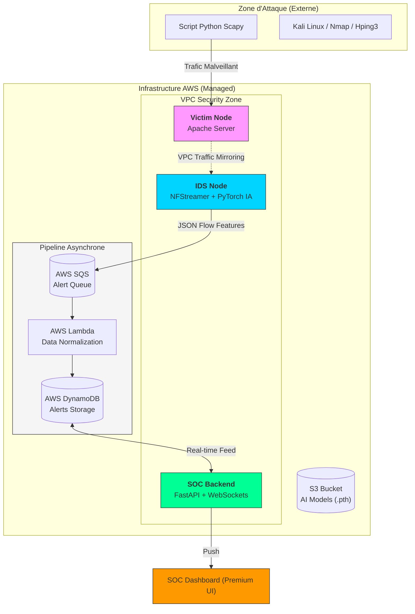

# PFE-NIDS-AI : Deep Learning-based Network Intrusion Detection System

[](https://opensource.org/licenses/Apache-2.0)
[](https://www.python.org/downloads/)
[](https://aws.amazon.com/)
[](https://www.terraform.io/)

## Présentation du Projet

Ce projet est un **Système de Détection d'Intrusion Réseau (NIDS)** développé dans le cadre d'un Projet de Fin d'Études (PFE). Il utilise des techniques avancées de **Deep Learning** pour identifier et classifier les cyber-attaques en temps réel en analysant les motifs du trafic réseau.

Contrairement aux systèmes IDS traditionnels basés sur des signatures, ce système utilise l'analyse comportementale pour détecter les menaces connues ainsi que les attaques sophistiquées de type **Zero-day**.

---

## Menaces Détectées

Le système est entraîné pour identifier avec précision les vecteurs d'attaque suivants :
- **DDoS / DoS** : GoldenEye, Hulk, Slowloris, etc.
- **Scanning** : Port Scanning (Nmap), Vulnerability Scanning.
- **Brute Force** : SSH, FTP (via Hydra).
- **Web Attacks** : SQL Injection, XSS, Infiltration.
- **Botnets & Malware** : Détection des communications C2.

---

- **Détection Multi-Architecture** : Évaluation de 11 modèles de Deep Learning (Attention MLP, CNN-LSTM, Transformers, etc.).
- **Temps Réel** : Pipeline d'inférence haute performance avec une latence < 5ms par flux.
- **Cloud Native** : Infrastructure AWS industrialisée via **Terraform** (IaC).
- **Dashboard Premium** : Interface SOC interactive en mode sombre pour une visualisation en temps réel.
- **Mirroring Passif** : Utilisation d'AWS VPC Traffic Mirroring pour analyser le trafic sans impact sur les performances des cibles.
- **Automated Lab** : Simulation d'attaques automatisée via scripts Python (Scapy) et Kali Linux.

---

## Performance des Modèles

Le projet a comparé **11 architectures différentes** sur le dataset **CICIDS 2017**.

| Modèle | Précision (%) | F1-Score (%) | AUC-ROC | Temps d'Entraînement |
| :--- | :---: | :---: | :---: | :---: |
| **Attention MLP** | **98.28** | **98.29** | **0.9995** | **Rapide (258s)** |
| **CNN-LSTM** | 98.14 | 97.99 | 0.9995 | Lent (3502s) |
| **ResNet1D** | 98.14 | 98.12 | 0.9995 | Moyen (639s) |
| BiLSTM | 97.92 | 97.94 | 0.9992 | Lent (2227s) |
| Transformers | 97.58 | 97.47 | 0.9991 | Très Lent (3213s) |

> [!TIP]
> Le modèle **Attention MLP** a été sélectionné pour le déploiement final en raison de son excellent compromis entre précision chirurgicale et efficacité de calcul.

---

## Architecture du Système

L'infrastructure est entièrement déployée sur **AWS (Region: eu-west-1)** et utilise une approche serverless pour le pipeline de données.



---

## Stack Technique

- **Intelligence Artificielle** : PyTorch, Scikit-learn, Pandas, NFStreamer.
- **Backend & API** : FastAPI, Pydantic, WebSockets.
- **Frontend** : Vanilla JS, CSS3 Modern (Dark Mode), Chart.js.
- **Infrastructure** : AWS (EC2, Lambda, SQS, DynamoDB, S3, VPC Mirroring).
- **IaC & DevOps** : Terraform, Ansible, GitHub Actions.

---

## Installation & Déploiement

### 1. Prérequis
- Python 3.10+
- Compte AWS configuré
- Terraform & Ansible installés

### 2. Déploiement Cloud
```bash
# Initialiser l'infrastructure
cd terraform
terraform init
terraform apply -auto-approve

# Configurer les instances (via Ansible)
cd ../ansible
ansible-playbook -i inventory setup_ids.yml
```

### 3. Lancer le Dashboard Localement (Mode Debug)
```bash
cd soc_dashboard/backend
pip install -r requirements.txt
python main.py

# Ouvrir soc_dashboard/frontend/index.html dans votre navigateur
```

---

## Documentation Complète

Pour plus de détails sur les spécifications techniques et les choix de conception, consultez le [Cahier des Charges](CAHIER_DES_CHARGES.md).

---

## Auteur
- **Mathieu** - Étudiant en Ingénierie Cyber-sécurité / IA.

---
*Ce projet a été réalisé dans le cadre d'un Stage de Fin d'Études (PFE).*
